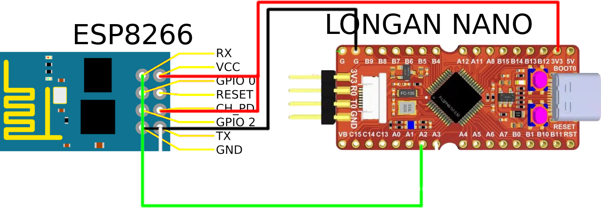

# Demo project for [longan nano](https://www.seeedstudio.com/Sipeed-Longan-Nano-RISC-V-GD32VF103CBT6-Development-Board-p-4205.html) risc-v based development board with networking

Demo project with networking for longan nano with networking. Longan nano connected to eps8266

## Wiring diagram



## Functionality

Fetches data from api and displays them on longan nano lcd. Currently fetching cpu usage% and temps with included [api.py](api.py) (flask app) and displays them.

## Building

Requires env variables to build:

- SSID = WiFi SSID
- PASSWORD = WiFi password
- SITE_IP = Api ip address
- SITE_PORT = Api port

## Flashing

Longan nano is flashed over usb-c connector and requires rust elf to be converted to bin format. This can be done with e.g. objcopy. See [flash.sh](flash.sh)

Build objcopy from https://github.com/sifive/riscv-binutils-gdb.git with

```bash
./configure --target=riscv64-unknown-elf --disable-werror --with-python=no --disable-gdb --disable-sim --disable-libdecnumber --disable-libreadline --with-expat=yes --with-mpc=no --with-mpfr=no --with-gmp=no
make
sudo make install
```

flashing can be done with e.g. dfu-util git://git.code.sf.net/p/dfu-util/dfu-util

## Running api

First you will need requirements: `pip install -r requirements.txt`

And then you can run it with `python3 api.py`

